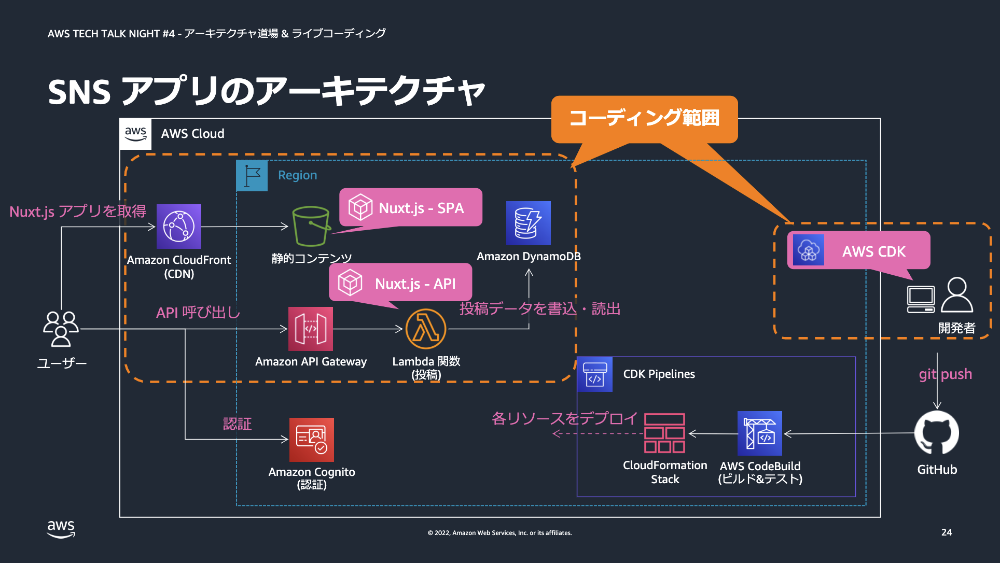

# AWS Tech talk Night#4

## アーキテクチャ道場＆ライブコーディング！Infrastructure as Code で SNS 風 Web アプリをデプロイしてみよう！

[AWS Tech talk Night#4](https://techplay.jp/event/880530)のライブコーディングでお見せしたコードです。



## 使い方

前提として、下記のソフトウェアをインストールしてください:

- [AWS CLI](https://docs.aws.amazon.com/cli/latest/userguide/getting-started-install.html)
- [Node.js (LTS 版)](https://nodejs.dev/learn/how-to-install-nodejs)

### Stack のデプロイ

```sh
npm ci
npx cdk bootstrap
npx cdk deploy
```

## 参考情報

CDK に興味をお持ちの方、始めてみたい方は、こちらの情報もご参照ください:

- [CDK Workshop](https://cdkworkshop.com/)
  - ゼロから CDK でアプリケーションを構築するワークショップです
- [AWS CDK Examples](https://github.com/aws-samples/aws-cdk-examples)
  - CDK のサンプルコード集です　多様なシステムのコード例が言語別に掲載されています
- [Construct Hub](https://constructs.dev/)
  - CDK の Construct 一覧です　日々様々な Construct が開発･公開されています

## Security

See [CONTRIBUTING](CONTRIBUTING.md#security-issue-notifications) for more information.

## License

This library is licensed under the MIT-0 License. See the LICENSE file.

